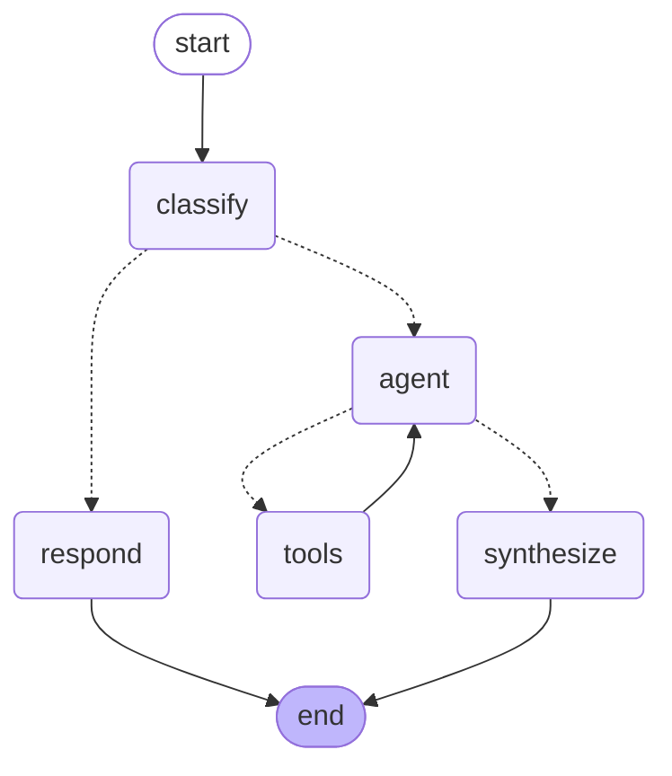

# VYOM — Agentic GIS for Indian Disaster Analysis

VYOM is an **AI assistant for satellite imagery**. You ask a plain-English question
about an Indian disaster — a flood, wildfire, drought or landslide — and VYOM finds
the right ISRO satellite scenes, runs the analysis, and answers you with text,
charts, and map layers, right inside QGIS.

It uses **Indian satellite data** (ResourceSat-2 / 2A from ISRO/NRSC, downloaded from
the **Bhoonidhi** portal) and a **safety-first AI agent** that always checks "do we
actually have data here?" before answering — so it never makes things up.

> **Two audiences, two starting points:**
> - **Just want to run the demo?** → Read **Part 1** below.
> - **Want to understand or extend the code?** → Jump to **Part 2**.

---

# PART 1 — For Guides & Viewers (Running the Demo)

You do **not** need to write any code or use the terminal. There are **two
double-click batch files** that do everything for you.

### Step 1 — Check the setup (first time only)

Double-click **`Check-VYOM-Setup.bat`**.

This runs a quick health check and prints a green/red checklist:
- ✅ Is Python installed?
- ✅ Are all the required packages present?
- ✅ Is the database connected and does it have data?
- ✅ Are the API keys configured?

If anything is missing, it will **offer to download and install it for you** —
just type `Y` and press Enter. When you see **"ALL CHECKS PASSED"**, you're ready.

### Step 2 — Start the server

Double-click **`Start-VYOM-Server.bat`**.

This starts VYOM's engine (the "server"). It is self-healing — if a package is
missing it installs it automatically. When it's ready you'll see:

```
Server URL ............  http://127.0.0.1:8000
```

A browser tab may open with a testing page — you can ignore it for the demo.

> ⚠️ **Keep this black window open.** It is the running server. Closing it stops VYOM.

### Step 3 — Open QGIS and launch VYOM

1. Open **QGIS** (the green map icon).
2. On the toolbar, click the **VYOM — Agentic GIS** button.
   *(If you don't see it: menu **Plugins → VYOM — Agentic GIS** to toggle it on.)*
3. A panel slides out on the right. The URL box already shows
   `http://127.0.0.1:8000` — click **Connect**.
4. When it turns green and says **Connected**, you're live.

### Step 4 — Ask a question

1. Pick a disaster event from the dropdown (e.g. *"Kerala floods 2018"*).
2. Type a question in the box at the bottom, or pick one from the
   *"pick an example question"* list.
3. Press **Ask** (or hit Enter).
4. Watch VYOM "think" — it shows each step it takes (a live loader animates while
   it works). When done you get:
   - a written answer with **charts** in the chat,
   - **map layers** drawn over the correct location in QGIS.

> While VYOM is answering, the box is **locked** so you can't accidentally send a
> second question — just wait for the loader to finish.

### Step 5 — Save a report (optional)

Click the **Report** button to save the whole chat session — all your questions,
VYOM's answers, the charts, and a snapshot of the map — as a **PDF file** you can
share or print.

### 📋 What can I ask?

See the full list of ready-to-use questions here:
**[test_query_list.md](test_query_list.md)**

It groups questions by type — casual ("Hi, what can you do?"), data discovery,
event-specific analysis (Kerala, Assam, Bihar, Uttarakhand, Marathwada, Sikkim),
and cross-event comparisons.

---

# PART 2 — For Developers (How It's Built)

This section explains the project in **simple terms** — what each folder does, the
technologies used, and how to add more data.

## The big picture

VYOM has three layers stacked on top of each other:

```
┌─────────────────────────────────────────────────────────┐
│  QGIS PLUGIN  — what the user sees (chat box, map)      │
├─────────────────────────────────────────────────────────┤
│  API SERVER   — receives questions, runs the AI agent   │
├─────────────────────────────────────────────────────────┤
│  THE AGENT    — the "brain": decides which tools to use │
│       │                                                 │
│       ├──► CATALOG tools  → ask the database            │
│       └──► RASTER tools   → open the image files        │
└─────────────────────────────────────────────────────────┘
        ▲                              ▲
        │                              │
   PostgreSQL + PostGIS          data/ folder (image files)
   (the searchable index)        (the actual pixels)
```

## How data is stored (this is the key idea)

VYOM splits data into two places, on purpose:

| Where | What it holds | Why |
|-------|---------------|-----|
| **`data/` folder** (local disk) | The actual satellite **image pixels**, saved as Cloud-Optimized GeoTIFFs (COGs) | Image files are huge (hundreds of MB each) — they live as files, not in a database |
| **PostgreSQL + PostGIS** (database) | The **metadata** — which scene, where (geometry footprint), when, cloud cover, sensor — plus **pre-computed index numbers** (NDWI, NDVI…) | This is small and fast to search. The agent queries this first to find the right scene |

So: **heavy pixels on disk, light searchable info in the database.** When the agent
needs a number it can read it instantly from the database; only when it needs to
draw a map or compute a fresh value does it open the big image file.

The `data/` folder is organised like this:

```
data/raw/<event>/<sensor>/<window>/<date>_<scene>.zip   ← original ISRO zips (Bhoonidhi)
data/ard/<collection>/<year>/<scene>/*.tif              ← processed COGs (the output)
data/manifests/<event>.csv                              ← a list telling the pipeline what to process
data/exports/                                           ← charts & images sent to the UI
```

## What's in each folder

```
config/                 Settings & registries — the "source of truth"
  events_registry.yaml    which disaster events exist (name, location box, hazard type)
  band_registry.yaml      which satellite sensors exist (bands, resolution, has SWIR?)

src/vyom/
  config.py             Central settings: paths, database URL, loads the registries

  ingest/               Reading the RAW satellite data
    audit.py              walks data/raw and counts scenes (a sanity check)
    band_meta.py          reads ISRO's BAND_META.txt → clean metadata + map footprint

  ard/                  The PRE-PROCESSING pipeline ("ARD" = Analysis-Ready Data)
    calibrate.py          raw pixel numbers → real surface reflectance (physics)
    indices.py            computes NDVI / NDWI / NBR / MNDWI (the "disaster indicators")
    cog.py                saves the result as a Cloud-Optimized GeoTIFF
    pipeline.py           runs all the above in order, scene by scene (the orchestrator)

  db/                   Talking to the database & images (these are the agent's TOOLS)
    writer.py             registers a finished scene + its metrics into PostgreSQL
    postgis_server.py     CATALOG tools — fast database lookups (psycopg2 only)
    gis_server.py         RASTER tools — opens image files, computes flood maps, exports PNGs

  agent/                The AI BRAIN
    orchestrator.py       the LangGraph state machine (decides what to do — see below)
    tools.py              the list of 11 tools the AI is allowed to call
    prompts.py            the instructions that tell the AI how to behave
    llm.py                connects to the LLM (Sarvam AI, with Groq/Gemini fallback)
    __main__.py           run the agent from the command line (for quick testing)

  api/                  The WEB SERVER (wraps the agent so the plugin can reach it)
    app.py                the endpoints: /health, /events, /scenes, /query, /exports
    models.py             the shapes of requests & responses
    charts.py             builds the charts (donut, bars…) from the agent's results
    __main__.py           starts the server: python -m vyom.api

  plugin/               The QGIS PLUGIN (what the user clicks)
    vyom_dockwidget.py    the chat panel UI (chat bubbles, map layers, Report button)
    api_client.py         talks to the API server over HTTP
    vyom_plugin.py        the plugin shell (adds the toolbar button)
    install.py            installs the plugin into QGIS
```

## The technologies we used

| Technology | What it does for us |
|------------|---------------------|
| **Python 3.11** | The language everything is written in |
| **LangGraph** | Builds the AI agent as a **state machine** — a flow chart the AI walks through (see the diagram below) |
| **Sarvam AI** (`sarvam-30b`) | The **LLM** (the actual "intelligence"). An Indian LLM, reached through an OpenAI-style API. Falls back to Groq or Google Gemini if needed |
| **PostgreSQL + PostGIS** | The database. PostgreSQL stores the scene catalog; **PostGIS** adds the ability to store and search **geographic shapes** (where each scene covers) |
| **rasterio + numpy + shapely** | Opening satellite images, doing the math on pixels, and handling map geometry |
| **FastAPI + uvicorn** | The web server that exposes the agent over HTTP |
| **QGIS + PyQt5** | The desktop GIS app and the plugin UI toolkit |
| **matplotlib** | Draws the charts that appear in the chat |
| **Cloud-Optimized GeoTIFF (COG)** | The image format — lets us stream just the part of a huge image we need, instead of downloading the whole thing |

## How the agent "thinks" — the LangGraph state diagram

The agent is a **flow chart**, not a single prompt. Every question walks through it:



In plain words:

1. **classify** — Is this a casual chat ("hi, what can you do?") or a real analysis
   question? Casual ones skip straight to **respond** and finish. No tools, no database.
2. **agent** — For real questions, the AI plans: "which tool do I call next?"
3. **tools** — The chosen tool runs (look up the catalog, compute a flood map, etc.)
   and the result goes back to **agent**. This loop repeats until the AI has enough.
4. **synthesize** — The AI writes the final, human-friendly answer.

**The safety rule:** before any data or image tool runs, the agent is *forced* to
call `check_coverage` first ("do we actually have scenes here?"). This is what stops
VYOM from inventing answers about places it has no data for.

## The pre-processing pipeline (raw data → ready-to-use)

When new satellite data arrives, it must be processed before the agent can use it.
The pipeline (`src/vyom/ard/pipeline.py`) does this for each scene:

1. **Read metadata** (`band_meta.py`) — parse ISRO's `BAND_META.txt`, work out the
   scene's footprint on the map.
2. **Calibrate** (`calibrate.py`) — convert raw sensor numbers (DN) into real
   **surface reflectance** using physics (TOA radiance → Dark Object Subtraction).
   Uses the GPU automatically if one is available.
3. **Compute indices** (`indices.py`) — calculate **NDWI** (water), **NDVI**
   (vegetation), **NBR** (burn), **MNDWI** — the numbers that reveal disasters.
4. **Save as COG** (`cog.py`) — write a Cloud-Optimized GeoTIFF to `data/ard/`.
5. **Register** (`writer.py`) — record the scene + its index numbers in PostgreSQL
   so the agent can find it.

The pipeline is **idempotent** — scenes already processed at the current version are
skipped, so you can safely re-run it.

```bash
# Process every scene in one event:
python -m vyom.ard.pipeline --event kerala_periyar_2018 --all
```

## What data we already have (from Bhoonidhi)

All scenes were downloaded from ISRO's **Bhoonidhi** portal (ResourceSat-2 / 2A).
**6 events, 338 scenes** are fully ingested and ready to query:

| Event | Hazard | Scenes | Sensors |
|-------|--------|--------|---------|
| kerala_periyar_2018 | flood | 88 | LISS3 + LISS4 |
| wildfire_uttarakhand_2016 | wildfire | 73 | LISS3 |
| bihar_kosi_ganga_2019 | flood | 64 | LISS3 + LISS4 |
| drought_marathwada_2016 | drought | 47 | LISS3 |
| assam_brahmaputra_2022 | flood | 42 | LISS4 |
| landslide_sikkim_glof_2023 | landslide | 24 | LISS3 + LISS4 |

## How to add MORE data

The short version (full details in **[DATA_ONBOARDING.md](DATA_ONBOARDING.md)**):

1. **Download** new scenes from Bhoonidhi and drop the zips into
   `data/raw/<event>/<sensor>/<window>/`.
2. **Register the event** in `config/events_registry.yaml` (name, location bounding
   box, hazard type, primary index).
3. **Check the sensor exists** in `config/band_registry.yaml`. If it's a new sensor
   (different bands/resolution), add it there first — otherwise calibration fails.
4. **Run the pipeline** to pre-process and register everything:
   ```bash
   python -m vyom.ard.pipeline --event <your_event_key> --all
   ```
5. Done — the agent can now answer questions about the new event.

**To change *how* pre-processing works** (e.g. a different cloud-mask threshold,
a new index, or support for a new metadata format), edit the relevant ARD file:
- new spectral index → `src/vyom/ard/indices.py`
- different calibration / sensor constants → `src/vyom/ard/calibrate.py`
- a new raw metadata format → `src/vyom/ingest/band_meta.py`
- overall processing order / rules → `src/vyom/ard/pipeline.py`

---

# PART 3 — Future Enhancements

Ideas to make VYOM more capable, in roughly increasing effort:

### Data & coverage
- **Add the remaining registered events** — several events have manifests ready but
  their imagery isn't ingested yet. Run the ARD pipeline to add them.
- **More hazards & regions** — expand beyond the current 6 events to national coverage.
- **Add Sentinel / SAR data** — radar (SAR) sees through clouds, which optical sensors
  can't. This would fix the biggest limitation for monsoon-season floods.

### Smarter ingestion (see DATA_ONBOARDING.md for the full plan)
- **Watch-folder automation** — drop a zip in a folder and it auto-processes, with no
  human running commands.
- **Automatic window classification** — let the system decide pre/event/post from the
  scene date instead of a human filling in a CSV column.
- **Multi-source ingest adapter** — accept data from sources other than ISRO's exact
  format (USGS, ESA, etc.) through a pluggable reader.

### Better analysis
- **Ground-truth validation** — compare VYOM's flood maps against official NRSC
  inundation maps to report real accuracy (IoU / precision / recall), not just
  internal consistency.
- **Same-AOI, co-registered comparison** — always clip scenes to a common footprint
  before comparing windows, so multi-sensor comparisons are scientifically valid.
- **Change-detection time series** — chart how flood/burn area evolves across many
  dates, not just two.

### Better experience
- **Conversation memory** *(optional, off by default)* — let the agent remember the
  previous question so follow-ups like "now do the same for Assam" work. (Deliberately
  not enabled today, to keep every answer independent and reproducible.)
- **Richer web UI** — bring the standalone React web app to full parity with the QGIS
  plugin.
- **Confidence & provenance** — show, for every answer, exactly which scenes and which
  cached numbers it was built from.

### Model & performance
- **Try larger / newer LLMs** — `sarvam-105b` or other models for harder reasoning.
- **GPU batch pre-processing** — speed up ingesting large archives.

---

## Quick reference — running from the terminal (developers)

```powershell
# Always set this first (so Python can find the vyom package):
$env:PYTHONPATH = "src"

# Start the API server:
python -m vyom.api                 # add --reload for hot-reload during dev

# Ask the agent directly, no QGIS:
python -m vyom.agent "How did water area change in the Kerala 2018 floods?"

# Process an event's imagery:
python -m vyom.ard.pipeline --event kerala_periyar_2018 --all
```

**Related docs:**
[test_query_list.md](test_query_list.md) · [DATA_ONBOARDING.md](DATA_ONBOARDING.md) · [CLAUDE.md](CLAUDE.md)
