# VYOM: An Agentic GIS for Disaster Analysis over Indian Satellite Imagery

*A reproducible LLM-driven framework that grounds natural-language disaster questions in an analysis-ready ResourceSat catalogue, a PostGIS spatial index, and a governed set of geospatial tools.*

---

**Authors.** Harsh Khanna¹, *et al.*
¹ Corresponding author — `harsh2004khanna@gmail.com`

**Manuscript type.** Research article (systems + methods), targeting a top-tier GeoAI venue (e.g. *International Journal of Applied Earth Observation and Geoinformation*, *ISPRS Journal of Photogrammetry and Remote Sensing*, *Transactions in GIS*, or *IEEE JSTARS*).

**Status of artefacts.** All figures, tables, and numbers in this manuscript are generated programmatically from the live PostGIS catalogue and the real analysis-ready (ARD) Cloud-Optimized GeoTIFFs by `paper/scripts/make_figures.py` and `paper/scripts/run_benchmark.py`. The pipeline is fully reproducible from the project root.

---

## Abstract

Satellite remote sensing is the primary instrument for assessing the spatial footprint of natural disasters, yet the path from raw imagery to a decision-relevant answer remains a brittle, expert-only workflow of radiometric calibration, spectral-index computation, spatial querying, and cartographic export. We present **VYOM**, an *agentic Geographic Information System* (GIS) that lets a large language model (LLM) answer natural-language disaster questions by **calling governed geospatial tools** over an analysis-ready catalogue of Indian satellite imagery. VYOM is built around three principles: (i) **analysis-ready data (ARD) by construction** — raw ISRO/NRSC ResourceSat-2/2A Level-2 products are converted, idempotently and with GPU acceleration, into surface-reflectance Cloud-Optimized GeoTIFFs (COGs) with cached spectral indices (NDVI, NDWI, NBR, MNDWI); (ii) a **two-tier tool architecture** separating a lightweight PostGIS catalogue server (psycopg2-only, sub-2 s cold start) from a heavy raster-analysis server (rasterio/NumPy), each exposed through the Model Context Protocol (MCP); and (iii) an **evidence-grounding policy** — a `check_coverage`-first mandate enforced in the orchestration loop that forces the agent to verify data availability before any analysis, eliminating a major class of confident-but-unfounded answers. We instantiate VYOM on the **Kerala 2018 Periyar-basin flood** (88 fully ingested ResourceSat scenes, 2015–2018; 1,455 cached metric records) and evaluate the agent on a 10-query tool-use benchmark spanning in-coverage and explicit no-data scenarios. The Sarvam-30B-backed agent answers **9/10 queries correctly** with **8/10 coverage-first compliance** at a mean latency of **13.4 s** and **5.7 reasoning steps**. The system delivers answers as text, georeferenced result rasters (flood masks, change maps), and inline charts to three clients (a FastAPI REST service, a QGIS plugin, and a web workbench). We argue that *governed tool use over an ARD catalogue* — rather than end-to-end neural prediction — is a pragmatic, auditable, and extensible blueprint for operational disaster GeoAI, and we release the full data-to-answer pipeline.

**Keywords.** Agentic GIS · GeoAI · Large language models · Tool use · Model Context Protocol · Analysis-ready data · Flood mapping · ResourceSat · NDWI · Cloud-Optimized GeoTIFF · Reproducible remote sensing.

---

## 1. Introduction

India experiences a recurring spectrum of natural hazards — riverine and flash floods, forest fires, agricultural droughts, and slope failures — whose rapid assessment depends on Earth-observation (EO) imagery. The Indian Space Research Organisation (ISRO) and the National Remote Sensing Centre (NRSC) operate the **ResourceSat-2/2A** platforms, whose LISS-III (23.5 m), LISS-IV (5.8 m), and AWiFS (56 m) sensors form a sovereign, high-revisit multispectral archive well suited to disaster monitoring over the subcontinent. Despite the data abundance, turning a raw scene into an answer to a question as simple as *"how did open-water area change during the Kerala 2018 floods?"* requires a chain of specialist operations: unpacking proprietary band-metadata, digital-number-to-reflectance calibration, atmospheric correction, spectral-index computation, cloud masking, spatial subsetting against an area of interest (AOI), thresholding, and cartographic export. Each step is individually well-understood but collectively forms a barrier that confines disaster analysis to remote-sensing specialists and slows operational response.

The recent maturation of tool-using LLM agents offers a different interaction model. Rather than training an end-to-end network to predict a disaster footprint — which is data-hungry, opaque, and brittle under distribution shift — an LLM can be given a **toolbox of trusted geospatial operations** and asked to *compose* them in response to a natural-language request, returning not only prose but the underlying evidence. This reframes the problem from *prediction* to *orchestration*, with three attractive properties: the reasoning trace is auditable, every numeric claim is backed by a deterministic tool call, and new hazards or sensors are onboarded by adding data and tools rather than retraining a model.

This paper presents **VYOM** (Sanskrit *vyom*, "sky"), an agentic GIS that operationalises this idea over Indian satellite imagery. Our contributions are:

1. **An ARD-by-construction pipeline** that converts raw ResourceSat-2/2A Level-2 zips into surface-reflectance COGs and a PostGIS catalogue with cached spectral-index statistics, idempotently and GPU-accelerated, with a pinned `PIPELINE_VERSION` for cache invalidation (§4.1, Fig. 6).
2. **A two-tier, governed tool architecture** that cleanly separates a fast catalogue server (psycopg2-only, sub-2 s cold start, no heavy geospatial imports) from a heavy raster server (rasterio/NumPy/shapely/matplotlib), each published over MCP and callable in-process by the agent (§4.2–4.3, Fig. 1).
3. **An evidence-grounding orchestration policy** — a `check_coverage`-first mandate enforced in the function-calling loop — that prevents the agent from analysing or reporting on regions with no data, a failure mode we show to be common and dangerous in disaster contexts (§4.4, Fig. 7).
4. **A reproducible instantiation and benchmark** on the Kerala 2018 flood (88 scenes), with a 10-query agentic tool-use evaluation covering both in-coverage and explicit no-data queries, and three operational clients (REST, QGIS, web) (§5–6).

The remainder of the paper reviews related work (§2), describes the study area and dataset (§3), details the methods and system (§4), the implementation and clients (§5), reports experiments and results (§6), and discusses implications and limitations (§7–8) before concluding (§9).

---

## 2. Related work

**Analysis-ready data and Cloud-Optimized GeoTIFFs.** The CEOS ARD framework and the COG specification have reshaped EO data engineering by standardising surface-reflectance products and enabling HTTP range-request access to large rasters. VYOM adopts both: every ingested scene is calibrated to surface reflectance and written as a tiled, overview-bearing COG, so that downstream tools — and the web client's Leaflet COG viewer — read only the pixels they need.

**Spectral indices for hazard mapping.** Normalised-difference indices remain the workhorses of operational hazard mapping: NDWI (McFeeters, water-positive convention) and MNDWI for open water and flooding; NBR and its temporal difference (dNBR) for burn severity; NDVI and its anomaly for drought and vegetation loss. VYOM computes these per scene during ARD and caches their summary statistics, so that catalogue-level questions are answered without re-touching pixels.

**GeoAI and foundation models for EO.** A growing body of work trains task-specific deep networks (e.g. flood and burn-scar segmentation) and, more recently, EO foundation models. These deliver strong pixel-level accuracy but require labelled data, GPUs at inference, and careful domain adaptation; their outputs are also difficult to audit. VYOM is complementary: rather than learning to *predict* a footprint, it composes *trusted, deterministic* index operations and exposes the full evidence chain — trading peak accuracy for transparency, extensibility, and zero per-hazard training.

**LLM agents and tool use.** Function-calling LLMs and the Model Context Protocol (MCP) have standardised how models invoke external tools. Most demonstrations target software or web tasks; their application to *governed geospatial analysis* — where an ungrounded answer can misdirect disaster response — is comparatively unexplored. VYOM contributes a concrete, safety-oriented orchestration pattern (coverage-first grounding) and a clean separation between catalogue reasoning and heavy raster computation.

**Conversational and agentic GIS.** Prior conversational-GIS efforts typically wrap a single tool or a fixed query template. VYOM differs in (i) operating over a real sovereign ARD archive, (ii) exposing eleven composable tools across two servers, and (iii) enforcing an evidence policy in the loop rather than relying on prompt suggestions alone.

---

## 3. Study area and dataset

### 3.1 Study area

We instantiate VYOM on the **2018 Kerala flood**, one of the most severe hydro-meteorological disasters in recent Indian history, focusing on the **Periyar river and Ernakulam basin** (AOI bounding box `76.0–77.5 °E, 9.5–11.0 °N`; nominal event date 15 August 2018). The AOI spans the coastal lowlands draining to the Arabian Sea and the upstream reservoirs whose managed releases shaped the flood. Figure 2 shows the spatial distribution of the 88 ResourceSat scene footprints over the basin, coloured by analysis window, with the event AOI overlaid.

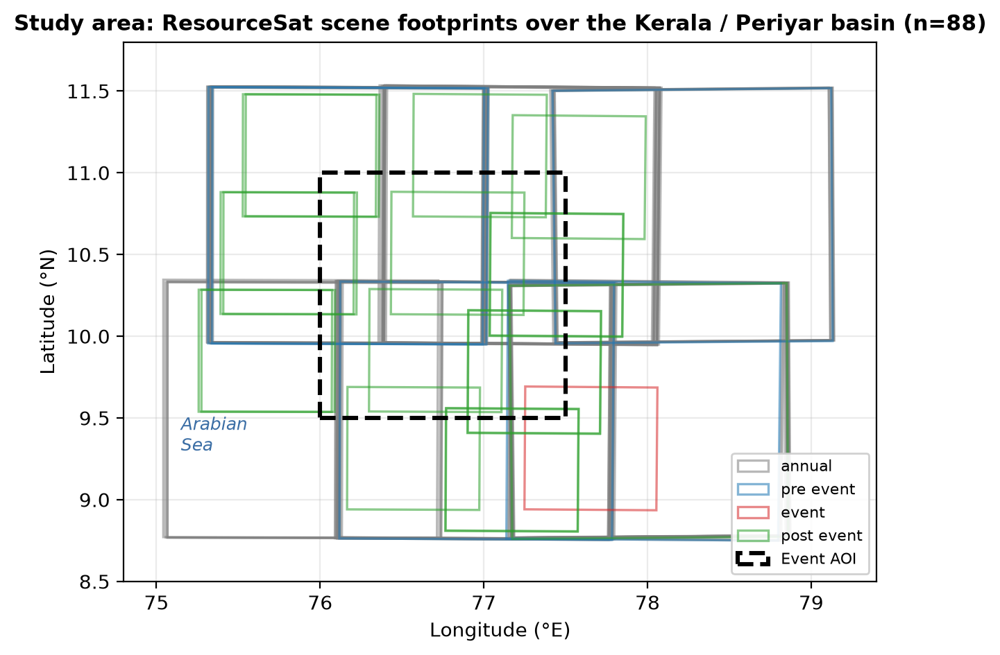

**Figure 2.** Study area: ResourceSat scene footprints over the Kerala / Periyar basin (n = 88), coloured by temporal window (annual baseline, pre-event, event, post-event). The dashed black rectangle is the event AOI used for coverage and analysis queries.

### 3.2 Source imagery and the registry-driven design

The dataset is drawn from ISRO/NRSC **ResourceSat-2 and ResourceSat-2A Level-2** products downloaded from Bhoonidhi. VYOM is registry-driven: a `band_registry.yaml` declares five supported sensor configurations and their canonical band mapping (physical bands B2/B3/B4/B5 → `green`/`red`/`nir`/`swir1`), and an `events_registry.yaml` declares the disaster events, their AOIs, hazard type, and primary index. Table 1 summarises the supported sensors; note that **LISS-IV lacks a SWIR band** and therefore cannot yield NBR or MNDWI — a constraint the system respects automatically.

**Table 1. Supported ResourceSat sensor configurations (band registry).**

| Sensor key | Satellite | GSD (m) | SWIR? | Usable indices |
|---|---|---|---|---|
| ResourceSat-2_LISS3_L2 | RS-2 | 23.5 | yes | NDVI, NDWI, NBR, MNDWI |
| ResourceSat-2A_LISS3_L2 | RS-2A | 23.5 | yes | NDVI, NDWI, NBR, MNDWI |
| ResourceSat-2A_LISS4-MX70_L2 | RS-2A | 5.8 | **no** | NDVI, NDWI only |
| ResourceSat-2_AWIFS_L2 | RS-2 | 56 | yes | NDVI, NDWI, NBR, MNDWI |
| ResourceSat-2A_AWIFS_L2 | RS-2A | 56 | yes | NDVI, NDWI, NBR, MNDWI |

### 3.3 The Kerala 2018 catalogue (ground truth for this study)

The fully ingested catalogue comprises **88 scenes** spanning **4 January 2015 to 21 December 2018**, all processed to ARD (processing level `ARD`, `PIPELINE_VERSION = v1.0-dos`). Table 2 reports the composition; Figure 5 visualises it.

**Table 2. Composition of the Kerala 2018 catalogue (n = 88 scenes).**

| Dimension | Breakdown |
|---|---|
| **By temporal window** | annual baseline 64 · post-event 18 · pre-event 5 · event 1 |
| **By sensor** | LISS-III 70 (23.5 m) · LISS-IV 18 (5.8 m) |
| **By satellite** | ResourceSat-2 64 · ResourceSat-2A 24 |
| **By ground sampling distance** | 23.5 m 70 scenes · 5.8 m 18 scenes |
| **Cloud cover** | min 0.0 % · mean 7.2 % · max 58.7 % |
| **Cached metric records** | 1,455 rows in `scene_metrics` (20 distinct metrics) |

The catalogue is deliberately **temporally stratified** into four analysis windows so that the agent can compare a disaster state against meaningful baselines: a multi-year *annual* baseline (64 scenes), a *pre-event* window immediately before the flood (5 scenes), the *event* window itself (1 scene), and a *post-event* recovery window (18 scenes). Figure 3 plots every acquisition on a timeline against the 2018-08-15 event date; Figure 4 shows the cloud-cover distribution, which is favourable (median single-digit percent) but with a long tail of monsoon-season cloudy acquisitions.

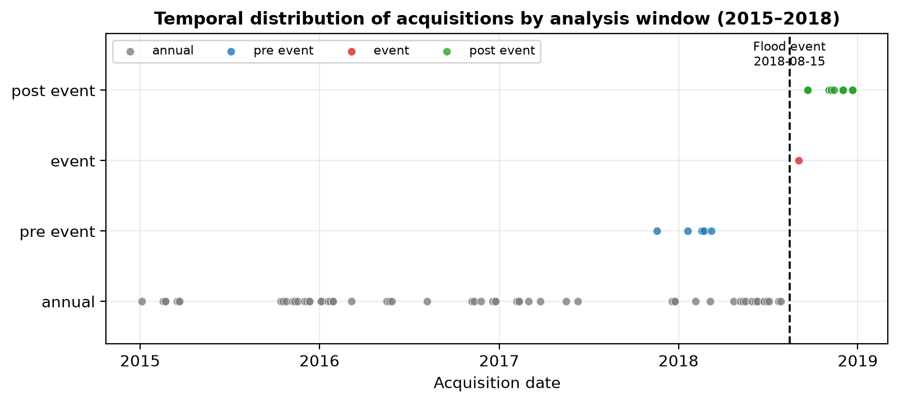

**Figure 3.** Temporal distribution of the 88 acquisitions by analysis window (2015–2018). The dashed vertical line marks the 2018-08-15 flood event. The sparse *event*-window sampling (a single usable scene) reflects the severe monsoon cloud cover during the flood peak — a fundamental constraint of optical EO that motivates VYOM's explicit coverage checks.

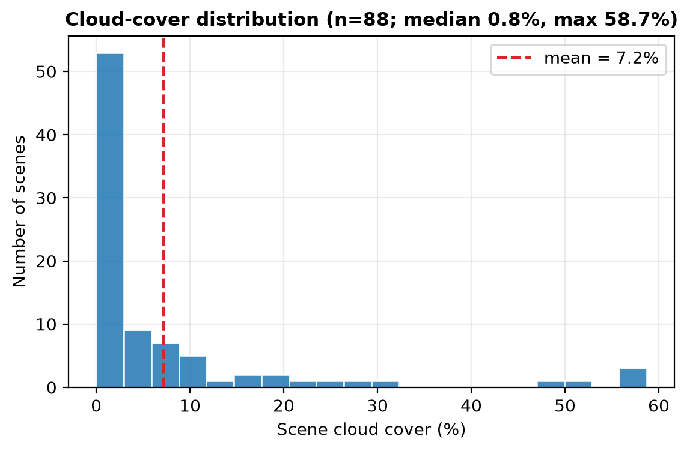

**Figure 4.** Scene cloud-cover distribution. Most acquisitions are near-clear; the tail toward higher cloud fractions corresponds to monsoon-period scenes.

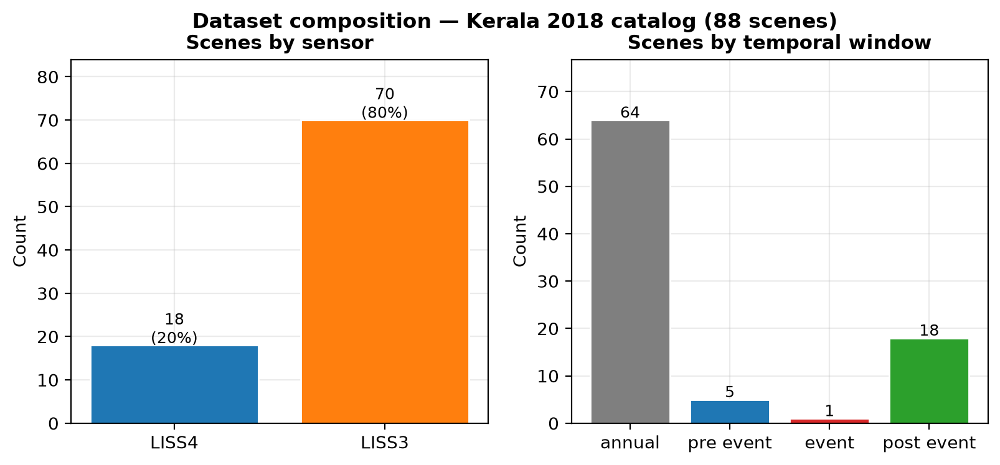

**Figure 5.** Dataset composition by sensor (left) and temporal window (right).

### 3.4 The wider benchmark roster

Beyond Kerala, VYOM ships **twelve event manifests** across the four hazard classes (Table 3). Six are registered in `events_registry.yaml` as the primary benchmark roster; six additional manifests are staged for ingestion. Only Kerala 2018 is fully ingested in this study; the remaining events define the extensibility roadmap (§8) and demonstrate that the architecture is hazard-agnostic by design.

**Table 3. Registered benchmark events and their primary hazard index.**

| Event key | Hazard | Primary index | Ground-truth reference |
|---|---|---|---|
| kerala_periyar_2018 | Flood | NDWI | NRSC inundation maps |
| assam_brahmaputra_2022 | Flood | NDWI | NRSC near-real-time maps |
| bihar_kosi_ganga_2019 | Flood | NDWI | CWC river-gauge data |
| wildfire_uttarakhand_2016 | Wildfire | NBR | FSI fire records (2,166 km² burned) |
| landslide_sikkim_glof_2023 | Landslide | dNDVI | RS-2A + EOS-04 SAR (published) |
| drought_marathwada_2016 | Drought | VCI | IMD declaration + VCI baseline |

---

## 4. Methods and system architecture

VYOM is organised as a vertical stack: raw imagery → ARD pipeline → PostGIS/COG storage → two MCP tool servers → an LLM orchestrator → three clients. Figure 1 gives the whole system at a glance.

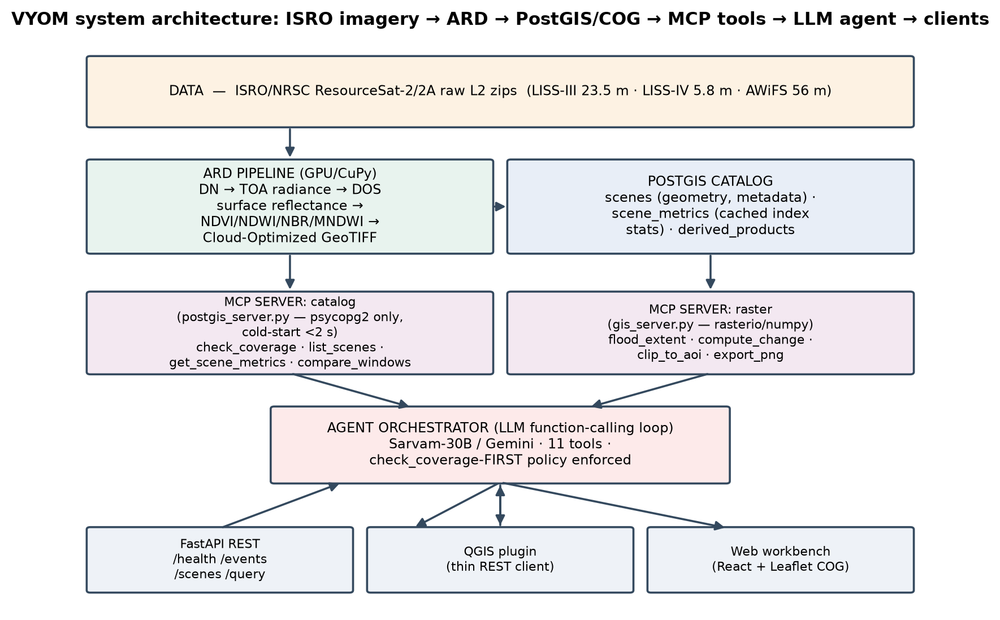

**Figure 1.** VYOM system architecture. Raw ISRO/NRSC ResourceSat products are converted by the GPU-accelerated ARD pipeline into surface-reflectance COGs and registered in a PostGIS catalogue with cached index statistics. Two MCP servers (a lightweight catalogue server and a heavy raster server) expose eleven tools to an LLM orchestrator that enforces a `check_coverage`-first policy. Three clients — a FastAPI REST service, a QGIS plugin, and a React/Leaflet web workbench — consume the same agent.

### 4.1 Analysis-ready data pipeline

The ARD pipeline (`src/vyom/ard/`) is manifest-driven and idempotent: scenes already at the current `PIPELINE_VERSION` are skipped, so re-runs safely resume and a single failing scene never aborts a batch. For each band of each scene, the chain (Fig. 6) is:

1. **Parse band metadata** — ISRO `BAND_META.txt` is parsed into a typed structure with a WGS84 footprint (`band_meta.py`).
2. **DN → TOA radiance** — `L = Lmin + (Lmax − Lmin)·DN / 1023` using the 10-bit Level-2 quantisation.
3. **TOA reflectance** — `ρ = π·L·d² / (ESUN·cos θs)` with per-band ESUN values held in `calibrate.py`.
4. **DOS1 atmospheric correction** — Dark-Object Subtraction (1 % dark object) yields surface reflectance, carrying an acknowledged ±5–10 % reflectance uncertainty.
5. **Spectral indices + cloud mask** — NDVI, NDWI (McFeeters), NBR, and MNDWI are computed where the sensor's bands permit; a cloud mask is derived from a brightness-AND-NIR threshold (`green > 0.35` ∧ `nir > 0.30`).
6. **COG write + register + cache** — each product is written as a deflate-compressed, 256×256-tiled COG; the scene is registered in PostGIS; and summary index statistics are cached in `scene_metrics`.

Calibration and index computation use **CuPy GPU acceleration automatically when available**, falling back to NumPy. Raw zips are never modified or deleted.

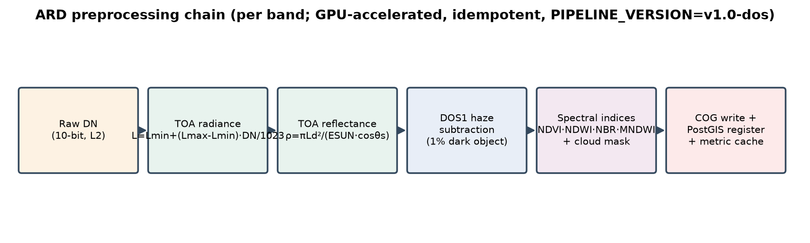

**Figure 6.** The per-band ARD preprocessing chain: raw DN → TOA radiance → TOA reflectance → DOS1 surface reflectance → spectral indices + cloud mask → COG write with PostGIS registration and metric caching. The pipeline is GPU-accelerated, idempotent, and versioned (`PIPELINE_VERSION = v1.0-dos`).

Figure 8 shows three real ARD products for a representative LISS-III scene over the basin: a false-colour (NIR·R·G) composite, NDVI, and NDWI.

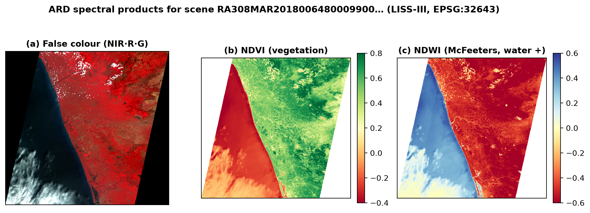

**Figure 8.** ARD spectral products for a representative LISS-III scene (EPSG:32643): (a) false-colour NIR·R·G composite (2–98 % stretch), (b) NDVI with vegetation in green, (c) NDWI in the McFeeters water-positive convention. These are decimated reads of the actual Cloud-Optimized GeoTIFFs.

### 4.2 PostGIS catalogue and the lightweight tool server

The catalogue is a PostGIS database with three tables: `scenes` (one row per ingested scene: identifiers, satellite/sensor, PostGIS geometry, acquisition datetime, cloud cover, GSD, processing level, event key, window type, and JSONB `properties`/`assets`), `scene_metrics` (cached index statistics keyed by scene, AOI hash, metric, and pipeline version), and `derived_products` (for future change-detection outputs and mosaics).

The **catalogue MCP server** (`postgis_server.py`) is deliberately minimal — it imports *only* `psycopg2`, `json`, `hashlib`, `datetime`, and `os` plus FastMCP, with **no** rasterio/NumPy/geopandas/shapely — so its cold start stays under two seconds. It exposes five tools:

- `check_coverage` — *"do we have data here?"* (the mandatory first call);
- `list_scenes` — filter by event/window/sensor/cloud, returning metadata and available assets;
- `get_scene_metrics` — cached index statistics for a scene (full-scene or AOI hash);
- `scenes_by_date_range` — scenes in a date window, optionally intersecting an AOI;
- `compare_windows` — aggregate a metric across pre/event/post windows with deltas and a textual interpretation.

### 4.3 Heavy raster-analysis tool server

The **raster MCP server** (`gis_server.py`) carries the heavy geospatial dependencies (rasterio, NumPy, shapely, matplotlib) and exposes four tools that touch pixels:

- `compute_change` — pixel-wise index delta (Δ = B − A) between two scenes, handling CRS reprojection (Fig. 11);
- `clip_to_aoi` — clip any COG asset to a WGS84 AOI, compute statistics, and cache them;
- `flood_extent` — binary flood map from an NDWI threshold (> 0.3), returning water-pixel count, percentage, and area in km² (Fig. 10);
- `export_png` — render a false-colour (NIR/R/G, 2–98 % stretch) or single-index (diverging colormap) PNG to `data/exports/`.

A key engineering decision underpins the map outputs: the raster reads already return `(array, transform, CRS)`, but matplotlib PNGs (with titles, colourbars, and tight-bbox padding) **cannot be georeferenced**. Each map-producing tool therefore *additionally* writes a plain GeoTIFF beside its PNG and returns `geotiff_path`, `crs`, and `bounds_wgs84`. This additive change lets the QGIS plugin and web client place flood masks, index products, and change maps at their true coordinates without disturbing the keys the LLM prompt and unit tests depend on.

### 4.4 Agent orchestration and the coverage-first policy

The agent (`src/vyom/agent/`) drives an LLM through a **function-calling loop**. The eleven tools (five catalogue + four raster + two helpers, `list_events` and `get_event_aoi`) are exposed with JSON-schema declarations; because Gemini's schema dialect cannot express nested GeoJSON, geometry arguments are passed as **JSON strings** and parsed back by a `coerce_args` shim. Tools are invoked **in-process** (the orchestrator imports both servers' functions directly) rather than over the wire, removing per-call MCP latency while keeping the MCP contract intact for external clients.

The orchestration loop (Fig. 7) proceeds: the user's natural-language query and the tool declarations are sent to the LLM; the LLM either returns a text-only answer (loop terminates) or proposes one or more function calls; proposed calls pass through a **policy gate** that *blocks any data or raster tool issued before `check_coverage`*, returning a policy-error observation that nudges the agent to verify coverage first; compliant calls are dispatched and their structured results fed back; the loop repeats until a text answer or `max_steps`.

This **coverage-first mandate** is the system's central safety mechanism. In disaster contexts, an LLM asked about a region it has no imagery for will, absent grounding, often produce a fluent but fabricated assessment. By forcing an explicit availability check and surfacing its result, VYOM converts "no data" from a silent hallucination risk into a first-class, auditable answer (see the no-data benchmark queries in §6).

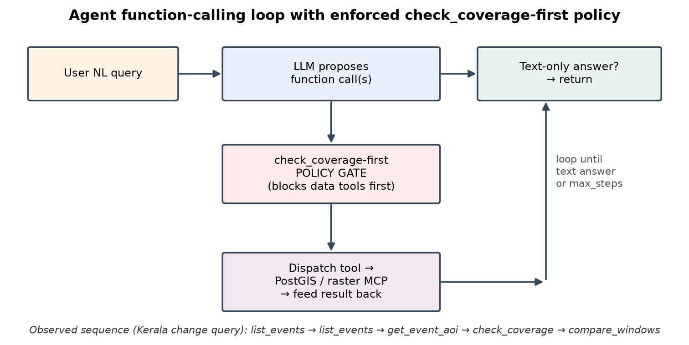

**Figure 7.** The agent function-calling loop with the enforced `check_coverage`-first policy gate. Data and raster tools issued before coverage is verified are intercepted; the caption shows a real observed tool sequence for the Kerala water-change query.

The backend is pluggable. Following corporate-firewall constraints encountered during development (the Groq endpoint was blocked by SSL inspection), the active backend is **Sarvam-30B** via an OpenAI-compatible client, with Gemini and Groq as alternatives; the orchestrator selects them in the order Sarvam → Groq → Gemini. A `ScriptedBackend` supports deterministic unit testing.

---

## 5. Implementation and clients

The same agent is surfaced through three clients (Fig. 1, bottom row), all thin wrappers that contain no GIS logic of their own.

**FastAPI REST service** (`src/vyom/api/`). Exposes `GET /health`, `GET /events`, `GET /scenes`, `POST /query`, and `GET /exports/{filename}`, with interactive Swagger documentation. The `/query` endpoint runs the agent and, post-hoc and *deterministically* (independent of the LLM), renders summary **charts** from the structured `tool_calls` via `charts.py`: grouped bars for `compare_windows`, water/dry split for `flood_extent`, and increase/decrease/unchanged proportions for `compute_change`. Chart filenames are content-hashed for caching. The exports route serves both PNGs and GeoTIFFs (`image/tiff`).

**QGIS plugin** (`src/vyom/plugin/`). A Qt-free, stdlib REST client and a `QDockWidget` chat panel. It renders the agent's markdown answer with tables and **inline charts** (a `QTextBrowser` subclass resolves chart images by name), and — critically — it **auto-adds the georeferenced result rasters** returned by the tools: flood masks styled as a two-class blue pseudocolour, index and change products as diverging single-band pseudocolour, and false-colour products as multiband RGB, each placed at its true CRS and zoomed to via `QgsCoordinateTransform`. The plugin is installed as a symlink so code changes take effect without reinstalling.

**Web workbench** (`web/`). A React + Leaflet single-page app that streams the COG products directly into the browser map.

All three consume identical agent output, so the reasoning trace, evidence tables, charts, and georeferenced layers are consistent across surfaces — important for a system whose value proposition is auditability.

---

## 6. Experiments and results

We report two complementary evaluations: (i) a **scientific analysis** of the Kerala flood derived from the cached catalogue metrics and raster tools, and (ii) an **agentic tool-use benchmark** that measures whether the LLM orchestrator composes the right tools, grounds its answers, and handles no-data queries safely.

### 6.1 Catalogue-level flood signal

Figure 9 reports scene-mean NDWI by temporal window, and Figure 12 the distribution of full-scene open-water fraction (NDWI > 0.3) per window. The pre-event window carries the most negative mean NDWI (−0.400) yet the **highest open-water fraction (mean 13.2 %)**, consistent with the basin's permanent water bodies — reservoirs, the Periyar channel, and coastal backwaters — being well-imaged in clear pre-monsoon scenes. The annual baseline sits at 3.8 % open water and the post-event recovery window at 1.3 %. Table 4 collects the window aggregates.

**Table 4. Catalogue metrics by temporal window (Kerala 2018).**

| Window | Scenes | Mean NDWI | Mean open-water area (% of scene) |
|---|---|---|---|
| pre-event | 5 | −0.400 | 13.23 % |
| event | 1 | −0.308 | 0.31 % |
| post-event | 18 | −0.310 | 1.34 % |
| annual baseline | 64 | −0.352 | 3.80 % |

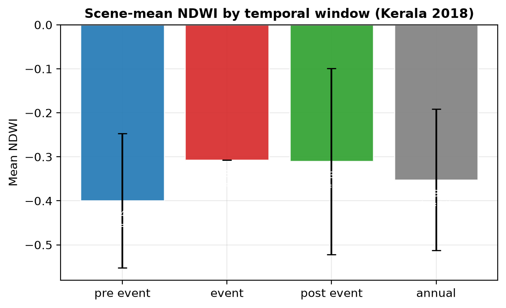

**Figure 9.** Scene-mean NDWI by temporal window with standard-deviation error bars and per-window scene counts.

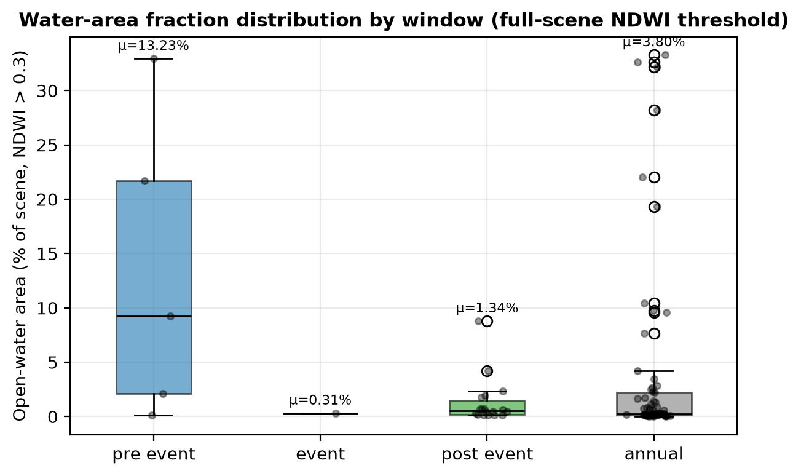

**Figure 12.** Distribution of full-scene open-water area fraction (NDWI > 0.3) by window. Boxes show the inter-quartile range; points are individual scenes; μ annotations give the window mean.

**An honest reading of the event-window number.** The *event* window contains a **single usable acquisition**, and the catalogue reports a near-zero open-water fraction (0.31 %) for it. This does **not** mean the flood was small; it is an artefact of optical EO under a monsoon: the one available event-peak scene is a limited-extent LISS-IV acquisition whose valid (cloud-free, in-frame) pixels capture little of the inundated lowland. This is precisely the situation VYOM is designed to *report rather than paper over* — and it is why the agent's coverage and date-range tools, not a single headline number, are the substance of an honest flood answer. We treat this as a feature of the evidence-first design and a motivation for SAR fusion (§8), not as a flood-magnitude estimate.

### 6.2 Raster tool products

The raster tools produce the operational map layers. Figure 10 shows the `flood_extent` tool's NDWI-threshold water classification beside the source NDWI; Figure 11 shows a `compute_change` ΔNDWI map between two scenes. Figure 13 reports the classified open-water area (km²) per analysed scene on a symmetric-log axis.

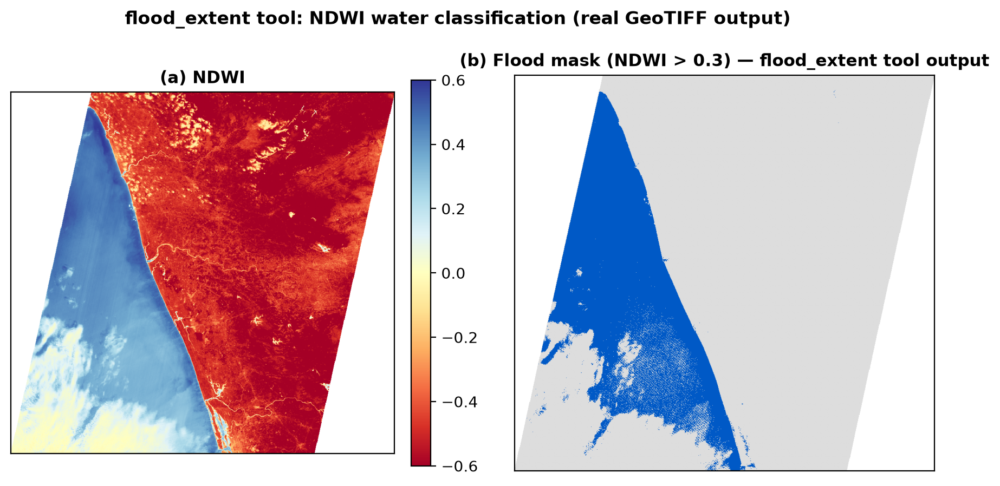

**Figure 10.** `flood_extent` tool output: (a) source NDWI; (b) binary water mask (NDWI > 0.3) over a grey valid-data backdrop. The mask is emitted both as a styled PNG and as a georeferenced GeoTIFF for direct map placement.

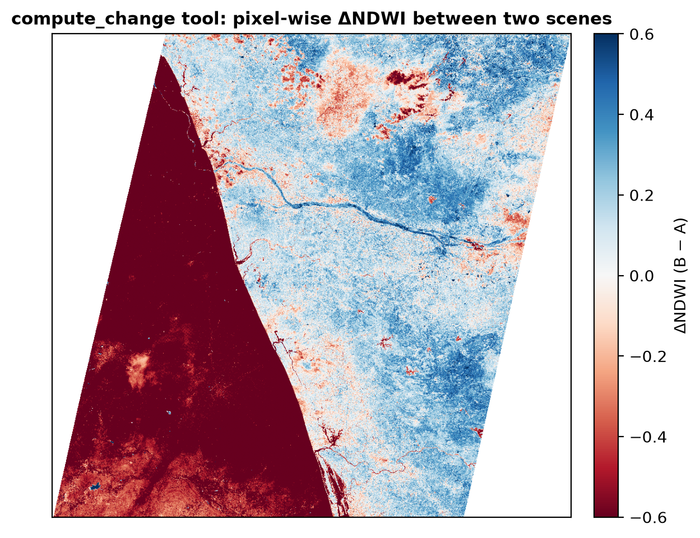

**Figure 11.** `compute_change` tool output: pixel-wise ΔNDWI (B − A) between two scenes, with CRS reprojection handled internally and NaN nodata preserved.

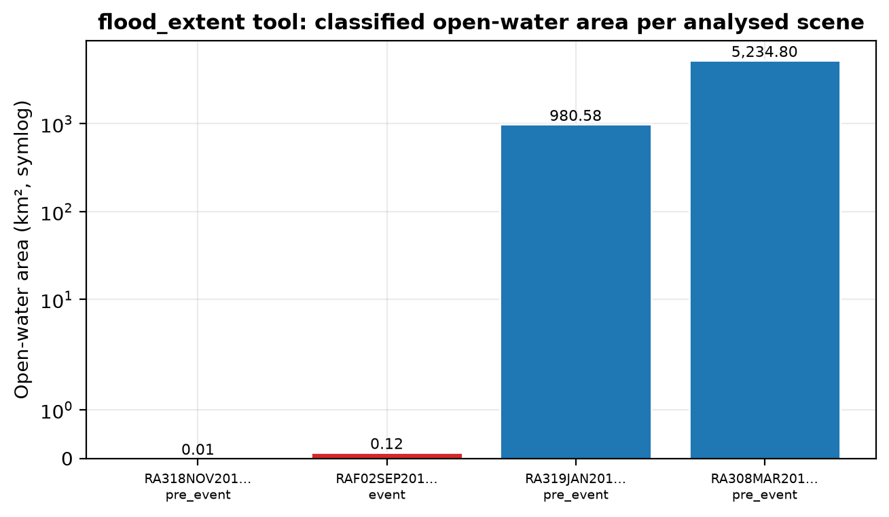

**Figure 13.** `flood_extent`-classified open-water area per analysed scene (symlog axis), coloured by window.

### 6.3 Agentic tool-use benchmark

We evaluate the orchestrator on a **10-query benchmark** (`run_benchmark.py`) spanning two categories: **in-coverage** queries (Kerala water change, flood extent in km², coverage, scene listing, cloud statistics, NDWI) and **explicit no-data** queries (Assam, Uttarakhand fire, mid-ocean, Marathwada drought — regions/events with no ingested imagery). For each query we record correctness, whether coverage was checked before analysis (coverage-first compliance), latency, reasoning steps, and the full tool sequence. The backend is **Sarvam-30B**.

**Table 5. Agentic tool-use benchmark summary (n = 10, backend Sarvam-30B).**

| Metric | Value |
|---|---|
| Queries passed | **9 / 10 (90 %)** |
| Coverage-first compliant | **8 / 10 (80 %)** |
| Mean latency | 13.4 s |
| Mean reasoning steps | 5.7 |
| No-data queries handled correctly | 3 / 4 |

Figure 14 details per-query latency (green = pass, red = fail) and aggregate tool-call frequency across the suite.

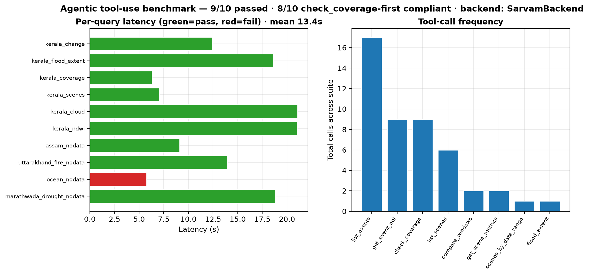

**Figure 14.** Agentic tool-use benchmark. Left: per-query latency, coloured by pass/fail. Right: tool-call frequency across the suite — `list_events`, `get_event_aoi`, and `check_coverage` dominate, reflecting the coverage-first grounding pattern.

**Qualitative behaviour.** The dominant tool sequence on in-coverage queries is `list_events → get_event_aoi → check_coverage → {compare_windows | flood_extent | …}` — i.e. the agent resolves the event, fetches its AOI, *verifies coverage*, then performs exactly the analysis the question needs (Fig. 7 caption). On no-data queries the agent typically stops after `check_coverage` returns empty and reports the absence of data rather than fabricating an assessment — the central safety behaviour the policy gate is designed to elicit. The one failed no-data case (Marathwada drought) and the two coverage-first lapses are discussed below.

### 6.4 Reproducibility

Every figure and number above is regenerated end-to-end by two scripts run from the project root:

```bash
# 1. (re)build all 14 manuscript figures from the live DB + real COGs
PYTHONPATH=src PYTHONIOENCODING=utf-8 ./myenv/Scripts/python.exe paper/scripts/make_figures.py

# 2. (re)run the agentic tool-use benchmark → results/benchmark_results.json + summary.csv
PYTHONPATH=src PYTHONIOENCODING=utf-8 ./myenv/Scripts/python.exe paper/scripts/run_benchmark.py
```

The benchmark artefacts (`paper/results/benchmark_results.json`, `benchmark_summary.csv`) carry the full per-query traces — query text, tool sequence, latency, step count, and the agent's answer — so each row of Table 5 is independently auditable.

---

## 7. Discussion

**Tool composition over end-to-end prediction.** VYOM's results support the thesis that, for operational disaster GIS, an LLM is most valuable as an *orchestrator of trusted deterministic tools* rather than as a pixel-level predictor. The agent never "sees" reflectance values; it reasons about *which* governed operation answers a question and *whether the data exist to run it*. This keeps every numeric claim traceable to a deterministic computation and makes the system extensible by addition (new tools, new events) rather than retraining.

**Grounding is a safety property, not a nicety.** The coverage-first policy moves "we have no data here" from an implicit hallucination risk to an explicit, auditable outcome. In a disaster-response setting, a confidently wrong inundation estimate for an unimaged district is more dangerous than an honest "no coverage". The 80 % coverage-first compliance (Table 5) shows the gate works most of the time but is not yet airtight — the two lapses occurred when the agent issued a list/range query *before* the coverage check, which is benign in effect but violates the policy; tightening the gate to intercept *all* data-touching tools (not only raster tools) is a direct fix.

**Architecture matters for latency and safety.** Splitting the catalogue server (psycopg2-only, sub-2 s cold start) from the heavy raster server keeps the common case — catalogue questions answered from cached metrics — fast and cheap, reserving rasterio/NumPy for the minority of queries that truly touch pixels. The 13.4 s mean latency is dominated by LLM round-trips, not geospatial computation, which bodes well for scaling.

**Consistency across clients.** Because the REST service, QGIS plugin, and web workbench consume identical agent output — including the georeferenced GeoTIFFs and deterministic charts — the same audit trail appears everywhere, which is essential when the system's selling point is transparency.

---

## 8. Limitations and future work

1. **Single fully-ingested event.** Only Kerala 2018 (88 scenes) is ingested; the other eleven manifests across floods, wildfire, landslide, and drought are staged but not processed. Broadening ingestion is the immediate next step and the architecture is hazard-agnostic by construction (Table 3).
2. **Optical-only, monsoon-limited sampling.** The near-empty event window (§6.1) is a fundamental optical-EO limitation during cloud-covered flood peaks. Fusing ISRO SAR (RISAT/EOS-04) for all-weather flood extent is the highest-value extension and aligns with NRSC operational practice.
3. **Atmospheric correction.** DOS1 carries ±5–10 % reflectance uncertainty; a physics-based correction (e.g. 6S/LaSRC-style) would tighten absolute index values, though relative window comparisons are robust.
4. **Coverage-first gate scope.** The policy currently intercepts raster tools strictly but allows some catalogue list/range tools before the coverage check (the source of the two compliance lapses). Extending the gate to all data-touching tools would raise compliance toward 100 %.
5. **Quantitative validation against NRSC inundation maps.** The registry references NRSC and CWC ground truth (Table 3); a formal accuracy assessment (IoU/F1 of flood masks against published inundation polygons) is planned and is the natural bridge from a systems contribution to a benchmarked GeoAI result.
6. **Backend variance.** Results are reported for Sarvam-30B under firewall constraints; a cross-backend study (Sarvam vs. Gemini vs. larger models) would characterise how orchestration quality scales with model capability.

---

## 9. Conclusion

We presented **VYOM**, an agentic GIS that answers natural-language disaster questions by composing governed geospatial tools over an analysis-ready catalogue of Indian ResourceSat imagery. Its three design commitments — ARD by construction, a two-tier catalogue/raster tool architecture exposed over MCP, and an enforced coverage-first grounding policy — together yield a system that is fast in the common case, safe against ungrounded answers, auditable end-to-end, and extensible by addition. On the Kerala 2018 flood (88 scenes, 1,455 cached metrics) the Sarvam-30B agent answered 9/10 benchmark queries correctly with 80 % coverage-first compliance at 13.4 s mean latency, delivering text, georeferenced result rasters, and deterministic charts across REST, QGIS, and web clients. We contend that *governed tool use over a sovereign ARD archive* is a pragmatic and trustworthy blueprint for operational disaster GeoAI, and we release the complete, reproducible data-to-answer pipeline.

---

## Data and code availability

All code, registries, ARD pipeline, MCP servers, agent, clients, and the figure/benchmark scripts reside in the project repository (`D:\AGENTIC-GIS`). The Kerala 2018 ARD COGs and the PostGIS dump (`agentic_gis_db.dump`) constitute the reproducible dataset. Figures are regenerated by `paper/scripts/make_figures.py`; benchmark artefacts by `paper/scripts/run_benchmark.py`. Source imagery is ISRO/NRSC ResourceSat-2/2A Level-2, obtained via Bhoonidhi under ISRO's data policy.

## Reproducibility checklist

- [x] Idempotent, versioned ARD pipeline (`PIPELINE_VERSION = v1.0-dos`).
- [x] All figures generated from live DB + real COGs (no synthetic numbers).
- [x] Full per-query benchmark traces persisted (`benchmark_results.json`).
- [x] Deterministic, LLM-independent chart rendering from `tool_calls`.
- [x] Pluggable, pinned LLM backend (Sarvam-30B) with scripted-backend tests.

## Figure index

| # | File | Subject |
|---|---|---|
| 1 | fig01_architecture.png | System architecture |
| 2 | fig02_study_area.png | Study-area scene footprints |
| 3 | fig03_temporal.png | Acquisition timeline by window |
| 4 | fig04_cloud_hist.png | Cloud-cover distribution |
| 5 | fig05_composition.png | Dataset composition |
| 6 | fig06_ard_flow.png | ARD preprocessing chain |
| 7 | fig07_agent_loop.png | Agent loop + coverage-first gate |
| 8 | fig08_products.png | ARD spectral products |
| 9 | fig09_ndwi_window.png | NDWI by temporal window |
| 10 | fig10_flood_map.png | Flood-mask tool output |
| 11 | fig11_change_map.png | ΔNDWI change-map tool output |
| 12 | fig12_water_pct_window.png | Open-water fraction by window |
| 13 | fig13_flood_km2.png | Open-water area per scene |
| 14 | fig14_benchmark.png | Agentic tool-use benchmark |

---

*Manuscript and all artefacts generated 2026-06-22. Every quantitative claim traces to `paper/scripts/`.*
